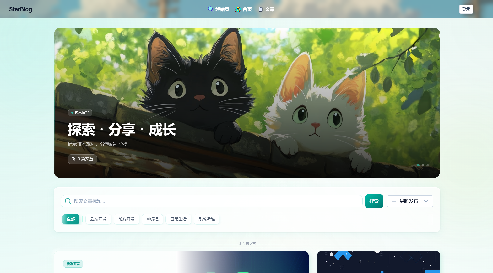
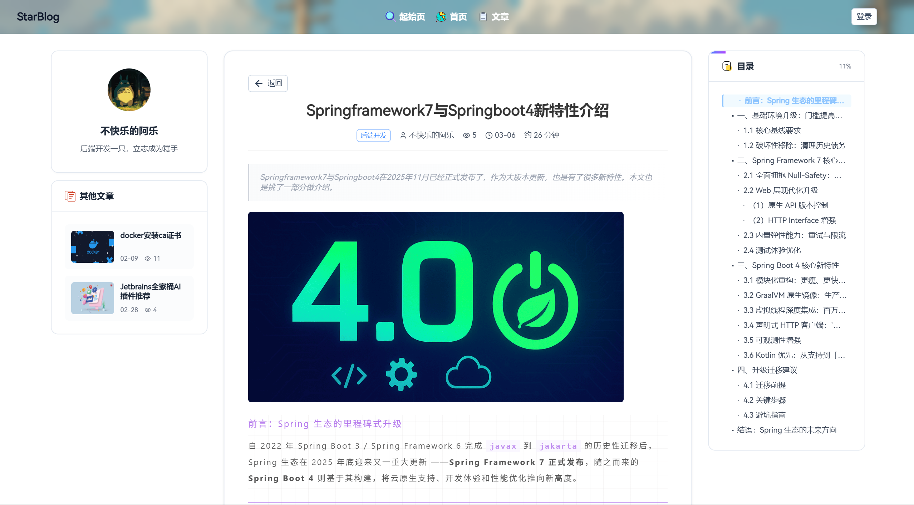
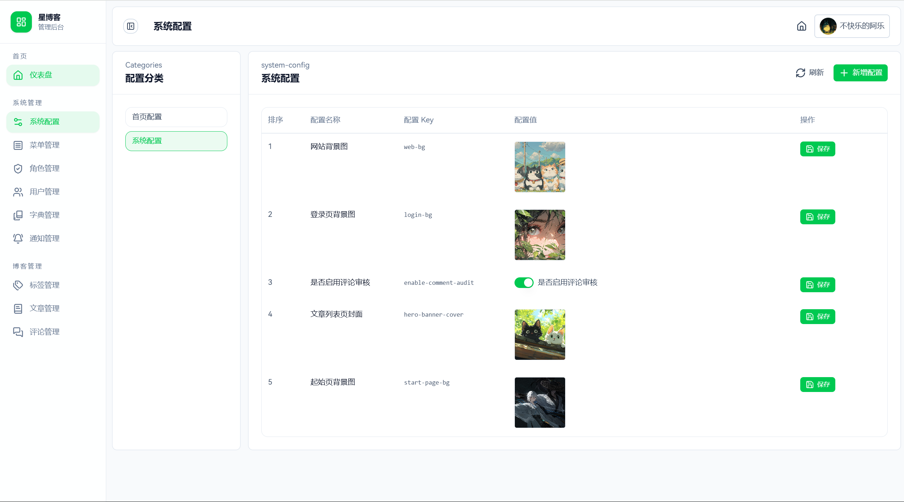

<div align="center">

# StarBlogWeb Nuxt

一个现代化的个人博客前端项目，基于 Nuxt 4 + Vue 3 + TypeScript 构建，包含博客前台与后台管理能力。


</div>

---

## ✨ 核心特性

- 🚀 **现代化技术栈**: 基于 Nuxt 4、Vue 3 Composition API、TypeScript 5、Vite 7 构建。
- ✍️ **富文本编辑能力**: 集成 ByteMD、Vditor、Monaco Editor，支持 Markdown 编辑与代码展示。
- 🔐 **动态权限与菜单**: 基于中间件、布局和菜单数据构建后台管理体验。
- ⚙️ **灵活的配置系统**: 支持文本、数字、日期、图片、JSON 等配置项管理。
- 🎨 **UI 与动效增强**: 使用 Nuxt UI、Tailwind CSS、Animate.css、Anime.js 构建交互体验。
- 📦 **Nuxt 原生能力**: 基于文件路由、布局、插件、运行时配置组织应用结构。

---

## 📸 界面展示

### 起始页


### 首页


### 文章列表页



### 文章详情页



### 后台管理页



---

## 🔗 在线演示

- 演示地址: `https://nuxt.ale-star-blog.cn/home`

---

## 🛠️ 技术栈

### 核心框架

| 类别 | 技术 | 说明 |
|------|------|------|
| 应用框架 | Nuxt 4 | SSR / SSG / 文件路由 |
| 前端框架 | Vue 3 | Composition API |
| 开发语言 | TypeScript | 类型约束与工程化支持 |
| 构建工具 | Vite 7 | Nuxt 底层构建能力 |
| 包管理器 | pnpm | 推荐开发方式 |

### UI 与样式

| 类别 | 技术 | 说明 |
|------|------|------|
| UI 组件库 | Nuxt UI | 主要界面组件方案 |
| CSS 框架 | Tailwind CSS 4 | 原子化样式 |
| 图像处理 | @nuxt/image | 图片优化 |
| 动画库 | Animate.css / Anime.js / Motion-v | 动效与过渡 |
| 样式扩展 | Sass | 全局样式组织 |

### 编辑器生态

| 类别 | 技术 | 说明 |
|------|------|------|
| Markdown 编辑器 | ByteMD | 后台文章编辑 |
| Markdown 编辑器 | Vditor | 备用编辑能力 |
| 代码编辑器 | Monaco Editor Loader | JSON / 代码配置编辑 |
| Markdown 主题 | juejin-markdown-themes | 文章展示主题 |

### 状态与能力扩展

| 类别 | 技术 | 说明 |
|------|------|------|
| 状态管理 | Pinia | 全局状态管理 |
| 组合式工具 | VueUse | 常用组合式能力 |
| 事件通信 | mitt | 轻量事件总线 |
| 数据校验 | zod | 数据结构校验 |

---

## 📋 功能清单

### 博客前台

- 首页展示
- 文章列表与文章详情
- 标签与推荐内容展示
- 评论与动态内容展示
- 动效化页面交互

### 管理后台

- 文章管理
- 标签管理
- 评论管理
- 菜单管理
- 角色管理
- 字典管理
- 系统配置管理
- 通知管理
- 用户资料维护

---

## 📁 项目结构

```text
star-blog-web-nuxt/
|-- app/
|   |-- api/                  # 请求封装
|   |-- apis/                 # 业务 API 定义
|   |-- assets/               # 静态资源
|   |-- components/           # 通用组件
|   |-- composables/          # 组合式函数
|   |-- config/               # 应用配置
|   |-- constants/            # 常量定义
|   |-- enums/                # 枚举定义
|   |-- layouts/              # Nuxt 布局
|   |-- middleware/           # 路由中间件
|   |-- pages/                # 文件路由页面
|   |-- plugins/              # Nuxt 插件
|   |-- stores/               # Pinia 状态
|   |-- styles/               # 全局样式
|   |-- types/                # 类型定义
|   |-- utils/                # 工具方法
|   |-- app.config.ts         # 应用配置
|   `-- app.vue               # 根组件
|-- build/                    # 构建辅助脚本
|-- public/                   # 公共静态资源
|-- nuxt.config.ts            # Nuxt 配置
|-- eslint.config.mjs         # ESLint 配置
|-- tsconfig.json             # TypeScript 配置
`-- package.json              # 项目依赖与脚本
```

---

## 🚀 快速开始

### 环境要求

- Node.js >= 18
- pnpm >= 8

### 安装与运行

```bash
# 1. 克隆项目
git clone <repository-url>
cd star-blog-web-nuxt

# 2. 安装依赖
pnpm install

# 3. 配置环境变量
cp .env .env.local

# 4. 启动开发服务
pnpm dev

# 5. 构建生产版本
pnpm build

# 6. 本地预览生产构建
pnpm preview
```

### 常用脚本

```bash
pnpm dev
pnpm build
pnpm preview
pnpm generate
```

### 环境变量

当前项目使用 Nuxt Runtime Config，示例配置如下:

```env
NUXT_PUBLIC_APP_TITLE=星博客
NUXT_PORT=3000
NUXT_APP_BASE_URL=/
NUXT_PUBLIC_API_BASE_URL=http://127.0.0.1:9091
NUXT_PUBLIC_DEFAULT_OSS_PROVIDER=minio
NUXT_PUBLIC_INSTANT_MESSAGE_SERVER_URL=ws://127.0.0.1:8081/ws
```

---
## 🤝 贡献指南

欢迎提交 Issue 或 Pull Request 来帮助改进项目。

### 提交 Issue

- 提供详细的问题描述
- 包含复现步骤和环境信息
- 附上相关截图或日志

### 提交 Pull Request

- Fork 本仓库并创建新分支
- 遵循项目代码规范
- 提交前执行 `pnpm lint` 检查代码
- 提供清晰的 PR 描述

---

## ⭐ Star

本人也是得到很多开源项目的帮助，因此本项目也是选择开源，希望能给更多朋友带来一点点启发。
如果这个项目对你有帮助，欢迎 Star 支持！

---

## 📜 开源协议

本项目基于 [Apache License 2.0](LICENSE) 开源协议。

---